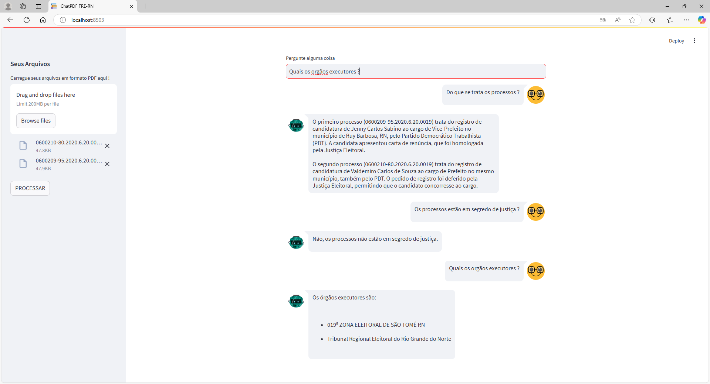

# 📚 AI Legal Chatbot - RAG-powered PDF Reader

Um chatbot baseado em *Deep Learning* e *Generative AI* com *Retrieval-Augmented Generation (RAG)*, capaz de processar PDFs de sentenças judiciais e simplificar consultas jurídicas.

## 🚀 Tecnologias Utilizadas

- **Linguagem**: Python 🐍  
- **Frameworks**: Streamlit  
- **Modelos**: LLMs (*gemini-1.5-flash*)  
- **Processamento de PDFs**: PyPDF2  
- **Busca Inteligente**: FAISS 
- **APIs de Chatbot**: LangChain / Gemini API  

## 📊 Arquitetura do Projeto

- **Pré-processamento**: Extração de texto dos PDFs.
- **Indexação**: Vetorização dos documentos com embeddings + FAISS.
- **Geração de Respostas**: Modelo LLMs (*gemini-1.5-flash*) aprimorado com RAG.
- **Interface**: Streamlit para interação com usuários.

## 📦 Instalação

Siga os passos abaixo para configurar o ambiente:

```bash
# Clone este repositório
git clone https://github.com/ArthurSilva635/IA-generativa

# Acesse a pasta do projeto
cd IA-generativa

# Crie um ambiente virtual (opcional, mas recomendado)
python -m venv venv
source venv/bin/activate  # Linux/macOS
venv\Scripts\activate  # Windows

# Instale as dependências
pip install -r requirements.txt

# Inicie o chatbot e abra no navegador
streamlit run app.py #Linux/macOS
```

## Interaja com o chatbot via UI web.

# Captura de Tela 1 📸


# Captura de Tela 2 📸



# Configurando Credenciais Google Cloud para Gemini (Google Generative AI)

Este guia explica como criar e baixar o arquivo **JSON de credenciais** para usar a API do modelo **Gemini** da Google Cloud em projetos de RAG (Retrieval-Augmented Generation).

# 🚀 Passo a Passo

## 1. Criar o Projeto no Google Cloud
1. Acesse o console: [Google Cloud Console](https://console.cloud.google.com/)
2. Faça login com sua conta Google.
3. Vá para **Console** → **Criar Projeto**.
4. Defina:
   - Nome do projeto: `chatbot-rag`
   - Organização: **(Opcional)**
5. Clique em **Criar**.

---

## 2. Ativar a API do Gemini (Google Generative AI)
1. No menu lateral, vá para **APIs e serviços** → **Biblioteca**.
2. Pesquise por **Generative Language API**.
3. Clique em **Ativar API**.

---

## 3. Criar a Conta de Serviço
1. Vá para **APIs e serviços** → **Credenciais**.
2. Clique em **Criar Credenciais** → **Conta de Serviço**.
3. Preencha:
   - Nome: `chatbot-rag`
   - ID: **(Gerado automaticamente)**
   - Descrição: **Conta para RAG usando Gemini**
4. Clique em **Criar e continuar**.
5. Permissões: Selecione **Editor**.
6. Clique em **Continuar** e depois em **Concluir**.

---

## 4. Gerar o JSON de Credenciais
1. Vá para **APIs e serviços** → **Credenciais**.
2. Clique na conta de serviço criada.
3. Vá para a aba **Chaves**.
4. Clique em **Adicionar Chave** → **Criar chave**.
5. Escolha o formato **JSON**.
6. Clique em **Criar**.

O arquivo **credentials.json** será baixado automaticamente para seu computador.

---

## 5. Configurar no Código Python
No seu projeto, adicione o arquivo **credentials.json** na raiz.

---


